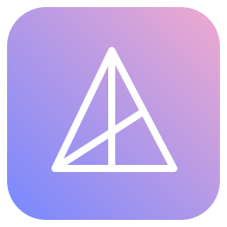
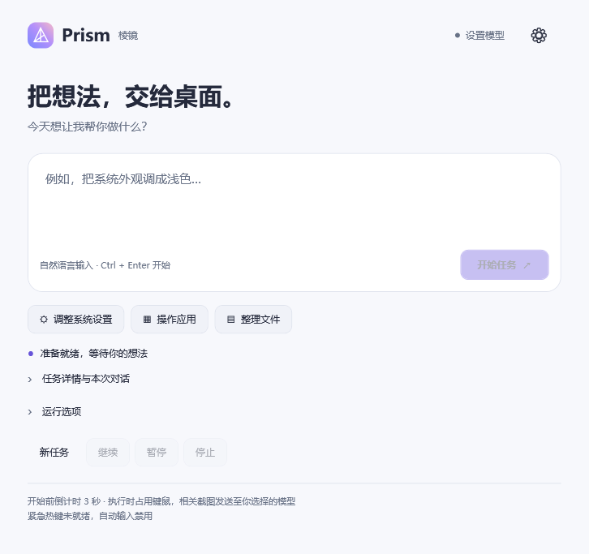
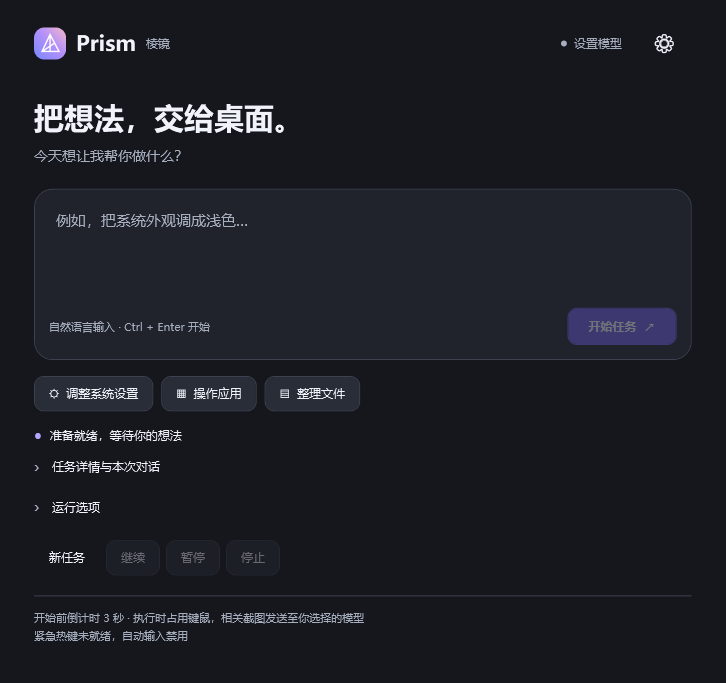
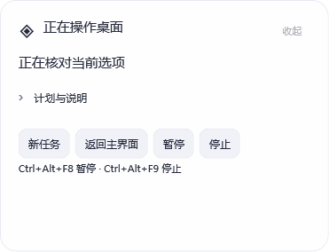
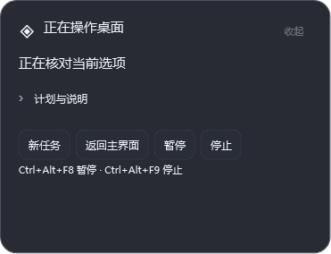

<div align="center">



# Prism · 棱镜

**把想法，交给桌面。 / Turn your intent into desktop action.**

一个由视觉模型驱动的原生 Windows 桌面助手。

`Windows 11` · `.NET 10 / WPF` · `自带模型密钥` · `0.2.0 Preview`

</div>

[简体中文](#简体中文) · [English](#english)

## 简体中文



用自然语言描述目标，Prism 观察当前界面、制定计划，再用真实系统鼠标和键盘操作。紧凑的悬浮卡显示当前步骤，点开即可查看理解、计划和执行反馈。

## 为桌面而设计

- **一个轻巧入口**：输入任务或点选示例，Ctrl+Enter 开始。
- **随时看懂进度**：默认只显示当前步骤，按需展开；回复与确认直接在卡片完成。
- **安静地待命**：完成后继续输入下一任务，也可收成小胶囊；主窗口关闭后留在托盘。
- **跟随你的外观**：浅色、深色、跟随系统；轻玻璃任务卡和运行中的彩虹边框。
- **真实控制，可随时接回**：原生 Windows 输入，支持暂停、紧急停止和逐步确认。

<details><summary>深色外观</summary>



</details>

### 专注当前这一步

 

任务完成后继续对话，或收成桌面上的小胶囊：


## 开始使用

1. 解压 Windows x64 便携包，保留整个目录，运行 **Prism.cmd**。若尚无发布包，可按下方说明从源码构建。
2. 打开设置，填写你自己的 API 地址、精确模型名称和密钥，保存连接。
3. 点击“验证辅助定位”：向你选定的模型发送两个自有测试窗口的截图，共 2 次 API 请求。可能产生服务商费用，不输入键鼠。
4. 验证通过后输入任务。开始前有 3 秒倒计时，让目标应用处于前台。

| 操作 | 快捷键 / 入口 |
|---|---|
| 开始任务 | Ctrl+Enter |
| 暂停 | Ctrl+Alt+F8 |
| 紧急停止 | Ctrl+Alt+F9 |
| 换一个目标 | 新任务 |
| 退出程序 | 右键托盘图标 → 退出 Prism |

默认连接预设是 `https://api.deepseek.com` / `deepseek-v4-flash-vision-exp`。需要你自己的服务访问权限；程序不会自动换型号或付费服务。另有 OpenAI-compatible、Kimi 和 GLM 配置入口，其模型可用性及视觉能力需各自验证。

## 当前版本边界

这是可分发的 **Preview 预览版**。本次主要交付外观与桌面交互更新，执行引擎的既有边界保留。辅助定位依赖应用提供可核对的控件；所有普通 Windows 软件、微信完整聊天查看和完整文件创建任务尚未统一验收。遇到无法可靠执行的步骤，会保留任务并等待用户继续。

本次界面截图由程序自己的界面诊断生成，不代表完成了图中文字所述的真实任务。发布检查见 [验收记录](docs/ACCEPTANCE.md)。

高风险操作默认关闭；可在具体权限阻塞时启用并继续原任务，具体提交仍需确认。发送消息必须核对联系人和完整内容，批准只用于该次提交。Prism 不绕过 UAC、验证码或系统权限。

## 数据与隐私

没有附带 API Key。执行时相关屏幕截图、控件文字和任务内容会发送至你配置的模型服务。密钥使用 Windows 当前用户加密存储；外观偏好单独保存在本机。源码与便携包均不包含开发者的本地配置、任务记录或私人桌面截图。详见 [隐私说明](docs/PRIVACY.md)。

## 从源码构建

需要 Windows x64 和 `global.json` 指定的 .NET SDK。PowerShell 7 中运行：

```powershell
pwsh -File scripts/Build.ps1 -Task Test
pwsh -File scripts/Build.ps1 -Task Package
```

便携包生成在 `releases/`。界面检查使用隔离配置，不调用模型或操作其他软件：

```powershell
dotnet run --project src/DesktopAgent.Windows -- --check-interface .build/interface
```

项目以 WPF 与 Windows API 实现界面、截图、控件读取和输入；Core 独立实现任务、模型协议、计划、恢复和批准流程。详见 [开发说明](docs/DEVELOPMENT.md)。

## GitHub 发布

当前目录是一份独立源码工作区。源码提交到仓库，`releases/` 内的 zip 与 SHA256 上传到 GitHub Release，按 Preview 发布。不要把本机配置、运行截图或历史任务日志提交进去。[发布说明](docs/RELEASE.md)

## 许可

项目采用 [MIT 许可](LICENSE)，运行时分发说明见 [第三方声明](THIRD-PARTY.md)。

---

## English

**Prism is a visual-model-powered native Windows desktop assistant.** Describe your goal in natural language; Prism observes the current interface, creates a plan, and operates real system mouse and keyboard input. A compact floating card shows the current step, with task understanding, plans, and execution feedback available on demand.

`Windows 11` · `.NET 10 / WPF` · `Bring your own API key` · `0.2.0 Preview`

### Designed for your desktop

- **A lightweight starting point:** enter a task or choose an example, then press Ctrl+Enter.
- **Progress you can understand:** see the current step by default; expand details when needed. Reply and approve directly in the floating card.
- **Ready for the next task:** continue after completion or collapse the assistant into a small capsule. Closing the main window keeps Prism in the system tray.
- **An appearance that fits:** light, dark, and system themes, a glass-style task card, and a rainbow border while running.
- **Real control, with a way back:** native Windows input, pause, emergency stop, and confirmation for specific high-impact actions.

The screenshots above show the light and dark interfaces, floating task cards, and idle capsule. They were generated by the application's own UI diagnostics; they do not demonstrate successful execution of the example tasks shown.

### Getting started

1. Extract a Windows x64 portable package, keep the entire directory together, and run **Prism.cmd**. If no release package is available, build one using the instructions below.
2. Open Settings, enter your own API endpoint, exact model name, and API key, then save the connection.
3. Select **验证辅助定位** (Validate assisted targeting). This sends screenshots of two application-owned test windows to your selected model, making **2 API requests**. Provider charges may apply. This check does not inject mouse or keyboard input.
4. After validation succeeds, enter a task. A 3-second countdown gives you time to bring the target application to the foreground before control begins.

| Action | Shortcut / entry point |
|---|---|
| Start a task | Ctrl+Enter |
| Pause | Ctrl+Alt+F8 |
| Emergency stop | Ctrl+Alt+F9 |
| Switch to a different goal | 新任务 (New task) |
| Exit the application | Right-click the tray icon → 退出 Prism (Exit Prism) |

The default preset is `https://api.deepseek.com` with the exact model `deepseek-v4-flash-vision-exp`. You need your own access to that service. Prism does not automatically switch models or paid services. Configuration entries are also provided for OpenAI-compatible services, Kimi, and GLM; model availability and vision capabilities must be validated separately.

### Current limitations

This is a distributable **Preview**, not a fully validated general-purpose desktop agent. This version primarily delivers appearance and desktop interaction updates while retaining the execution engine's existing limitations. Assisted targeting depends on the application exposing verifiable controls. Support for arbitrary Windows applications, complete WeChat chat inspection, and complete file-creation workflows has not been comprehensively accepted. When a step cannot be performed reliably, Prism preserves the task and waits for the user to continue.

UI diagnostics are not evidence of real model task completion. See the [acceptance record](docs/ACCEPTANCE.md) (Chinese) for the validation scope and remaining gaps.

High-risk operations are disabled by default. When a task is blocked by a specific permission requirement, you can enable the option and continue; the concrete submission still requires confirmation. Sending a message requires checking the recipient and full message content, and approval applies only to that submission. Prism does not bypass UAC, CAPTCHAs, or system permissions.

### Data and privacy

No API key is included. Relevant screenshots, control text, and task content are sent to the model service you configure. API keys are encrypted for the current Windows user, and appearance preferences are stored locally. Source and portable distributions exclude the developer's local configuration, task history, and private desktop screenshots. See the [privacy notice](docs/PRIVACY.md) (Chinese).

### Building from source

Use Windows x64, PowerShell 7, and the .NET SDK specified by `global.json`:

```powershell
pwsh -File scripts/Build.ps1 -Task Test
pwsh -File scripts/Build.ps1 -Task Package
```

Portable packages are generated under `releases/`. The following UI check uses isolated configuration and does not call a model or operate other applications:

```powershell
dotnet run --project src/DesktopAgent.Windows -- --check-interface .build/interface
```

WPF and Windows APIs provide the interface, screen capture, read-only control inspection, and native input. The separate Core layer implements task state, model protocols, plans, recovery, and approval flows. UI Automation assists with read-only targeting; actions still use real system input. See the [development guide](docs/DEVELOPMENT.md) (Chinese).

### Publishing

Source code is maintained in this repository. Portable ZIP files and their SHA256 checksums are intended for GitHub Releases, labeled as Preview. Do not commit local configuration, runtime screenshots, or historical task logs. See the [release guide](docs/RELEASE.md) (Chinese).

### License

Prism is distributed under the [MIT License](LICENSE). See [third-party notices](THIRD-PARTY.md) for redistribution details.

[返回中文 / Back to Chinese](#简体中文)